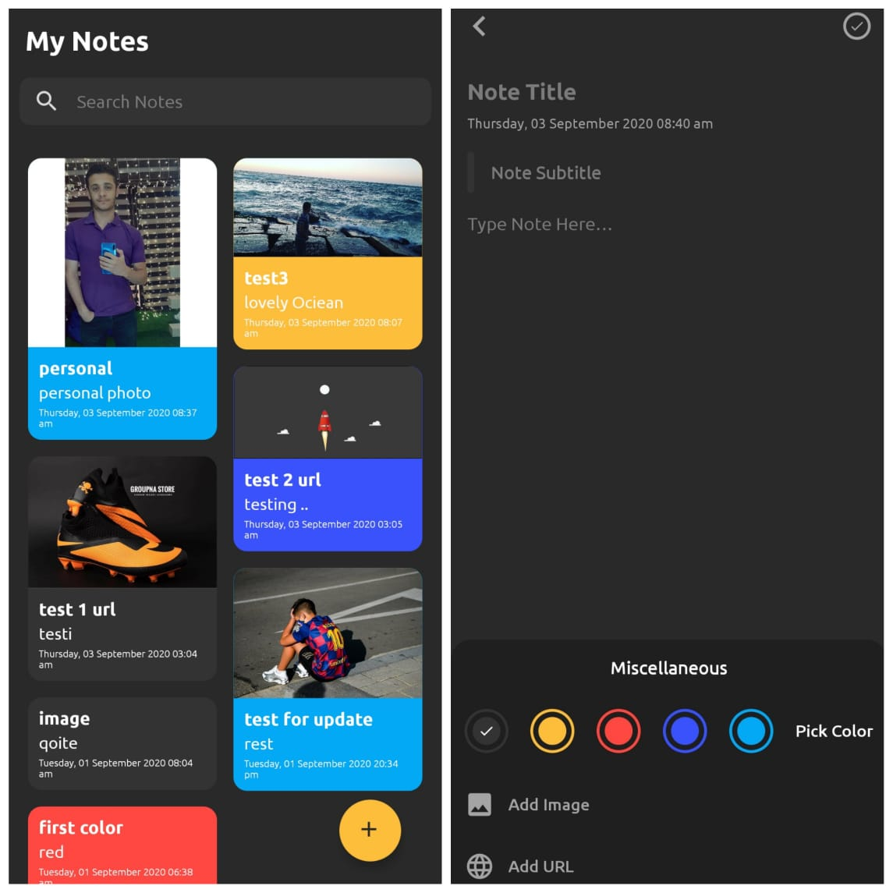

# ToDoNote
This is the code that powers the Material Notes / Notes app on Android by Ahmed Ramadan.

# Highlights of the application features
- Room Library: The library provides an abstraction database access while harnessing the full power of SQLite.
- Recycler View:  to display a scrolling list of elements based on large data sets is more advanced and flexible.
- Material Design: Material is a design system created by Google to help teams build high-quality digital experiences for Android, iOS, Flutter, and the web.
- RoundedImageView: A RoundedImageView library that supports rounding any corner or circular shape. RoundedImageView is extended from AppCompatImageView.
-  SDP(scalable dp): Scalable Size Unit (support for different screen sizes)

# ScreenShot

  
